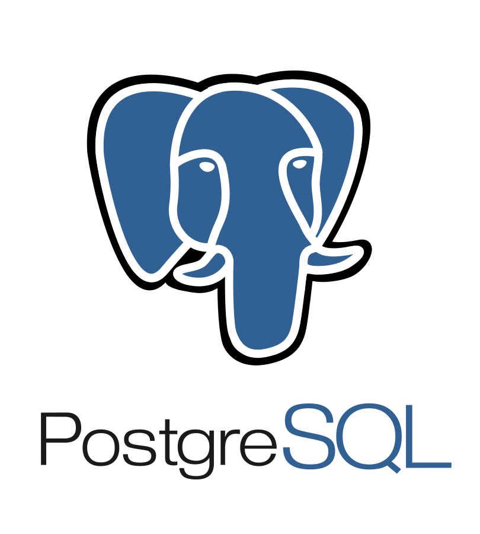
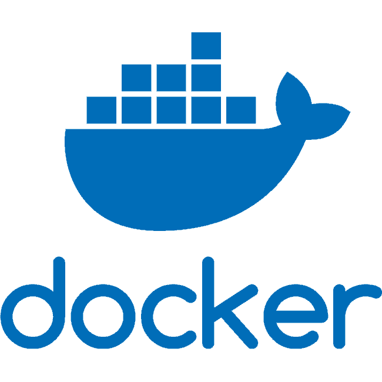

# Liga_CUT
Este es un proyecto basado en 4 microservicios o mas para un sistema o aplicacion web para la gestion de ligas universitarias. actulmente se piensa primero implementar a un nivel local (Cutonala)

# Stack Tecnologico
-  **Python – FastAPI**  
-  **PostgreSQL** 
-  **Next.js**
- **Docker**

# Microservicio de gestion de permisos de usuario y autenticacion
registro y acceso para usuarios, generacion de token JWT, Rutas Auth 
y Rutas para el panel de permisos

