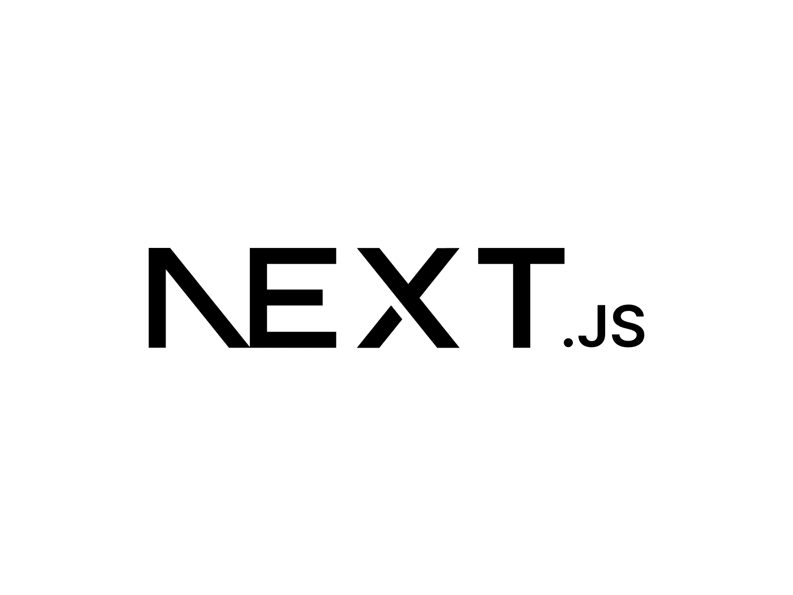

# Liga_CUT
Este es un proyecto basado en 4 microservicios o mas para un sistema o aplicacion web para la gestion de ligas universitarias. actulmente se piensa primero implementar a un nivel local (Cutonala)

# Stack Tecnologico
-  **Python – FastAPI**  
-  **PostgreSQL** 
-  **Next.js**
- **Docker**

# Microservicio de gestion de permisos de usuario y autenticacion
registro y acceso para usuarios, generacion de token JWT, Rutas Auth 
y Rutas para el panel de permisos

- Hasheo de contraseñas: passlib: CryptContext
- Manejo asincrono de la base de datos con Asyncio, nos deja hacer sesiones asincronas
- tokens: Jose-JWT

# Endpoints funcionales (para usuarios)

- login: ingreso de un usuario a la app a partir de su correo y contraseña
- register: registro de correo normalizado y contraseña de minimo 8 caracteres
- token: este endpoint es para proteger otras endpoints para volverler a pedir a tal usuario otra ves su token y tipo (bearer), tiene mucha utilidad para reutilizacion en distintos endpoints por ejemplo verificar su login, su permiso

# Endpoints no funcionales (para desarrolladores y administradores)

- dashboard: requiere una dependencia el cual verifica si un usuario aparece su correo como administrador de permisos para usuarios

# login y register

- esto ya esta funcionando totalmente (token para cada uno de los usuario, contraseñas hasheadas en db y asincrono)

-  **Inicio**  
-  **Login**  
-  **Register** 

